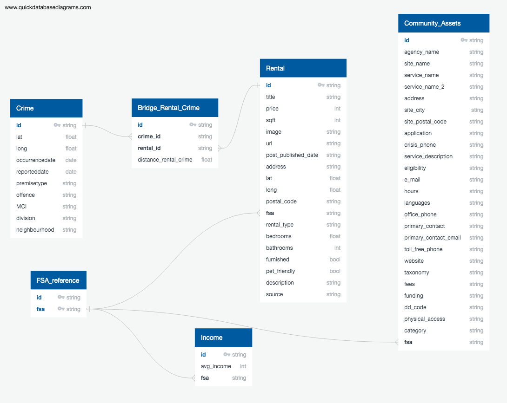

# Toronto Rental ETL Project

While Toronto is a beautiful place to live, no one would claim it is easy to find a place to rent in Toronto. To help current and potential Toronto residents better understand rental options available to them, we created a database containing the most recent rental listings as well other indicators of what it might be like to live at each address. 

The following outlines the process for extracting, tranforming and loading data into the database. 

 

 

## Extract

 

### Rental Data

Two sources were used to extract rental listing data - Craigslist and Kijiji.
  
#### Craigslist

Craigslist provides a well structured [URL](https://toronto.craigslist.org/search/hhh) to scrape rental posting data based on an area (Eg:- Toronto) and site (Eg:- Downtown Toronto). We used [craigslist python module](https://pypi.org/project/python-craigslist/) to extract all the direct URLs to the posts in the Toronto area and then scraped the posts using CSS selectors in [selenium.](https://selenium-python.readthedocs.io/) Please refer the [code.](Code/craigslist_and_crime_api_scraping_transform.ipynb)

#### Kijji

Kijiji provides rental information that includes apartment features such as apartment location and cost.

Rentals fall into three main categories: Long term rentals, Short term rentals , Rooms and Roommates rental. The Kijiji website is not dynamic and quite easy to scrape. A simple url request along with BeautifulSoup library was used for the data scrapping.

Kijiji provides rental information that includes apartment features such as apartment location and cost [See Code.](Code/kijiji_api_scraping_transform.ipynb)

### Toronto Police Services Open Data

Two sources of data were extract from Toronto Police Services - major crime indicators and community services.

#### Major Crime Indicators
Toronto Police Services (TPS) provides a <a href="https://data.torontopolice.on.ca/pages/catalogue">catalogue of data sources</a> that includes incidence of crime. Crimes are tracked in a number of categories and availabe in consolidated dataset - Major Crime Indicators (MCI). TPS provides an <a href="https://data.torontopolice.on.ca/datasets/mci-metadata/geoservice">API</a> to easily access the MCI. 
We have made use of this API call and merged with homicide data available on the TPS website. Please refer the [code](Code/craigslist_and_crime_api_scraping_transform.ipynb)

#### Community Assets
The TPS data catalogue includes <a href="https://torontops.maps.arcgis.com/home/item.html?id=077c19d8628b44c7ab9f0fff75a55211&view=list&sortOrder=true&sortField=defaultFSOrder#data">data tables</a> identifying organizations providing services to Toronto communities. Unfortunately, this data source is not accessible via an API. Web scrapping was used to extract the community asset data.

The website is dynamic, meaning it needs to be interacted with in order for the data of interest to be accessed from back-end server then displayed on the webpage. 

The Selenium and BeautifulSoup libraries were used to interact with and extract the data table rows [See Code](Code/Community_assets/Community_Assets). 

The webpage provides access to different tables via drop-down menu. Selenium's Select function was used to move between tables. 

The static HTML only contains a subset of the data tables rows at a given time. In order to access all the data rows, the code iteratively scrolls through the data tables and scrapes the static HTML. Scrolling was achieved identifying the last row in the static HTML and clicking on it via Selenium's click() function. This triggered the webpage's Javascript to view that row as the new top row in the table thus triggering it to update the static HTML.    

### Government of Canada 2015 Income Data

A CSV file was downloaded from <a href="https://www.canada.ca/en/revenue-agency/programs/about-canada-revenue-agency-cra/income-statistics-gst-hst-statistics/individual-tax-statistics-fsa/individual-tax-statistics-fsa-2017-edition-2015-tax-year.html#toc9">the Government of Canada website</a> containing Individual 2015 tax statistics by forward sortable areas (FSA). FSA are the first three digits of a postal code. The Pandas library was used to read the file into a dataframe for transformation. [See Code.](Code/pandas_reading_files.ipynb)

 

 

## Transform

 

### Rental Data

#### Craigslist
One of the ``challenges`` with craigslist data was that it doesn't have a structure in the post. A user could write the rental features the way he/she pleases. We used ``excessive use of regular expressions to extract meaningful attributes`` like square feet, type of the house, no. of bedrooms, no.of bathrooms etc. 

Apart from the regular cleaning process,
This data had some null values for the location. As, we had to use the location to connect with the crime data, we retrieved the lat, long locations based from address using ``google geocode API``

Similarly, wherever the geotag(lat, long) was present and not address, we retrieved the postal code using ``google's reverse geocode API``. The postcode was later converted to FSA(first 3 digits of the postal code) and used to connect to community and Income data. Please refer the [code.](Code/craigslist_and_crime_api_scraping_transform.ipynb)

#### Kijji

A list of urls was created by scrapping the main rentals webpage. Using these urls we extracted apartment features from each apartment url creating a DataFrame for the rental_kijiji_table.

Further transformations then included removing extra columns, extracting columns such as FSA and postal codes from the address, removing rows without postal information; and updating headers to reflect best practices for SQL databases and be able to merge with Craigslist data.

### Toronto Police Services Open Data

#### Major Crime Indicators
Apart from the regular cleaning, timestamps were converted to the iso format and only the last 1 year of crime data was taken into consideration for connecting with the rental data logically. As crime data has two sources, ``data from API`` and ``homicide CSV file``, both were transformed into a unique template.
Please refer the [code.](Code/craigslist_and_crime_api_scraping_transform.ipynb)
  
#### Community Assets

Each data table was transformed into a dataframe. Once duplicates were removed, the individual dataframes were incorporated into a master dataframe.

Further transformations then included removing rows without postal information; normalizing how fees for services are described; and updating headers to reflect best practices for SQL databases.

<h4>Government of Canada 2015 Income Data</h4>

 Rows for FSA outside of the City of Toronto (for which FSA begin with 'M') were removed from the dataframe.  Average income was calculated pre FSA by dividing “Total Income” by “Total” (population). 

 

## Load

 

### Connection Logic:

#### Connecting the Rental and Crime Table
This was a ``challenging task`` as there was no postal code in crime data to connect the with the rental data, but there was geocode. Though the geocodes alone could not be connected directly, ``We built a logic around the geocode and created a bridge table. This bridge table connects the rental postings to all crime events that happened within 3kms radius in the last 1 year``. To measure the distance between two locations, we use ``haversine distance``. This resulted in a bridge table of ``1.4 Million rows``. Though this method has a lot of advantage (For instance, user can check crime data at any granularity within 3 km) compared to using the static postal codes, we plan to migrate to postal code logic to reduce growing the table size.

#### Connecting the Rental to Community through Income
Rental data connects with community data through FSA. To handle this ``many-many`` relationship, we have used the Income table which has unique FSA codes connecting to both the tables.

### DB & Schema
We have used PostgreSQL DB to load the data with [this schema.]()
SQL Alchemy is used to load the data to the corresponding tables. Code [here.](Code/SQL_Load.ipynb)
All the tables have established desired Foreign key relationships as shown in ERD.

 

## Next Step
- **Scan for other available sources of geographic data that can enrich database as indicators of what it is like to live at each rental location.**
- **Develop an application that scrapes the daily rental listings in real-time to show the data.**
